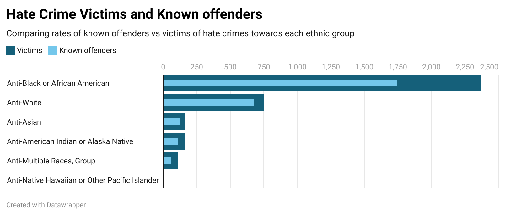

# Looking at Hate Crime statistics 
### Unit.3.ENGL.105
This is a repository containing instrucitonal materials and sample datasets for Prof. Gotzler's Fall 2022 sections of ENGL-105 at the University of North Carolina at Chapel Hill.

The repository contains three python notebooks, covering basic topics on coding and markdown with Python3, and modules explaining how to use the Pandas package for data analysis. There is also a fourth Python notebook which outlines, step by step, how to create your own subset of data from a much larger data base.

The data included is Hate Crime Statistics based on different religious, ethnic, and gender groups

## Where the data is from
The first three notebooks have been adapted from the excellent lessons created by the staff at the [Research Hub](https://library.unc.edu/data/) of UNC's Davis Library. The fourth notebook was created by me for an assignment in a Jupyter notebook

The data provided comes from the [FBI Uniform Crime Reporting Program](https://ucr.fbi.gov/hate-crime/2013) statistics.

## Using the data
This data is used to compare hate crime statisitcs in 2013 among differnt, racial, religious, and gender groups. It includes data about victims, known offenders, incidents and offenses. This is especially useful for local jurisdiction to look at and compare the data to more recent statistics. Thus showing how hate crimes are changing. It can also be useful for anyone intrested in doing research on how these certian crimes affect different groups.

This repository was created as I have extreme intrest in how crime affects differnt groups of people and how they compare. The data included does just that and it allows anyone to analyze it and create their own subsets; You can follow the steps included in the data file. The data can be manipulated in several differnt ways to create the perfect subset for whatever you are looking for.

Shown below is a visualization of the custom subset I created from the raw data included in this repository. The chart shows the difference between victims and known offenders of Hate Crimes against different ethnic groups. 

!

I hope this has helped! if you have nay questions or see an error contact me at willfarrell03@gmail.com

